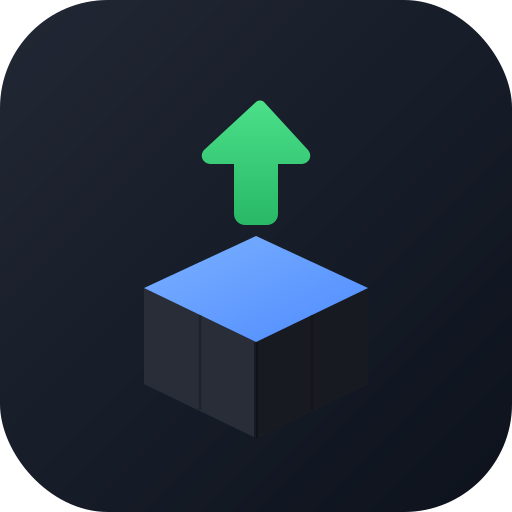

# PKG Sender for PS4

Send your own PS4 homebrew `.pkg` files straight to your console over FTP, without digging out a USB stick every time.

Windows · macOS (Intel & Apple Silicon) · Linux · Android

---

## What is this

If you're used to copying `.pkg` files onto a USB drive and plugging it into your PS4 every time you want to install something, this replaces that step. Drop a file in the app, it goes straight to your console over your local network, done.

It's built around a simple idea: your computer or phone connects *out* to the PS4, never the other way around. A lot of similar tools work by having the PS4 pull the file from your PC, which means your PC has to accept an incoming connection — and that's exactly the kind of thing Windows Firewall, ESET, and pretty much every antivirus blocks by default. Fixing that usually means messing with firewall rules or needing admin rights you might not have. This app sidesteps the whole problem by only ever connecting outward.

The one thing you still have to do manually: once the transfer's done, open Package Installer on the PS4 to actually run the install. Same as you'd do with a USB drive — there's no way around that part, at least not without opening your PC up to incoming connections, which isn't worth it just to save one tap.

## Features

Drag and drop on desktop, or pick a file from your file browser on Android. It goes to `/data/pkg`, the same spot GoldHEN's Package Installer checks when you install from USB, so there's nothing to configure there. You get a live progress bar with actual transfer speed while it's sending, and there's a small file browser built in so you can see what's already been sent to the PS4 and delete old files without needing to open a separate FTP client.

## What you'll need

A jailbroken PS4 running GoldHEN with its FTP server turned on (port 2121 by default), and your PC or phone on the same network as the console — same WiFi, or Ethernet, doesn't matter which as long as they can see each other.

As for firmware — this app doesn't really care what firmware your PS4 is on, it's just talking FTP to GoldHEN. What matters is whether GoldHEN itself supports your firmware. Right now that's 5.05, 6.71/6.72, 7.0x/7.5x, 8.0x/8.5x, 9.00/9.03/9.50/9.60, 10.00/10.01, 10.50, 10.70/10.71, 11.0x/11.5x, 12.50, and 13.00. That list changes as new exploits come out, so it's worth checking GoldHEN's releases page directly before you jailbreak or update anything — and remember PS4 firmware can't be downgraded once you've updated, so double check compatibility first.

## Getting it

| Platform | File |
|---|---|
| Windows (64-bit) | `pkg-sender-windows.zip` |
| macOS, Apple Silicon (M1/M2/M3/M4) | `pkg-sender-macos-applesilicon.zip` |
| macOS, Intel | `pkg-sender-macos-intel.zip` |
| Linux (x64) | `pkg-sender-linux.zip` |
| Android | `pkg-sender-android.apk` |

Grab the latest from [Releases](../../releases). Desktop versions don't need installing, just unzip and run the executable.

## How to use it

Turn on the FTP server on your PS4 through GoldHEN first. Open the app, put in your PS4's IP (you'll find it under Settings → Network → View Connection Status on the console) and the FTP port. Drop your `.pkg` in, hit send, and watch it go. Once it's finished, head over to the PS4 and open Package Installer to install it. If you want to clean up old files later, there's a section at the bottom of the app that lists what's on the PS4 and lets you delete it straight from there.

## A note on speed

Don't expect miracles — transfer speed is mostly limited by your network and by how fast the PS4 itself can write to its drive, not by this app. GoldHEN's FTP server just isn't built for speed, so somewhere around 3-10 MB/s is normal and doesn't mean anything's wrong. If you can, plug the PS4 into Ethernet instead of WiFi, it usually helps more than anything else you could try.

## Platform-specific stuff

**Windows** — if SmartScreen throws up an "unknown publisher" warning, click "More info" then "Run anyway." That's just because the app isn't signed with a paid certificate, not a sign anything's wrong.

**macOS** — first launch will probably get blocked with a "developer cannot be verified" message. Right-click the app, hit Open, confirm. You only have to do that once.

**Linux** — might need to `chmod +x` the file first. If you run into a sandbox error, launch it with `--no-sandbox`.

**Android** — you'll need to allow installs from unknown sources the first time, since this isn't on the Play Store.

## Building it yourself

The desktop app is built with Electron and uses the `basic-ftp` library for the FTP side of things. Android is a native Kotlin app using Apache Commons Net, built through Android Studio. Everything you need is in this repo if you want to build from source instead of using the prebuilt releases.

## One thing to be clear about

This app moves files you already have onto a console you already own. It doesn't download anything, doesn't host or distribute any game content, and there's no search or "paste a link" feature anywhere in it — just a drag-and-drop box and an FTP connection. Use it with files you actually have the right to install. Not affiliated with Sony or the GoldHEN team, just a tool that talks to GoldHEN's FTP server.

## License

MIT
